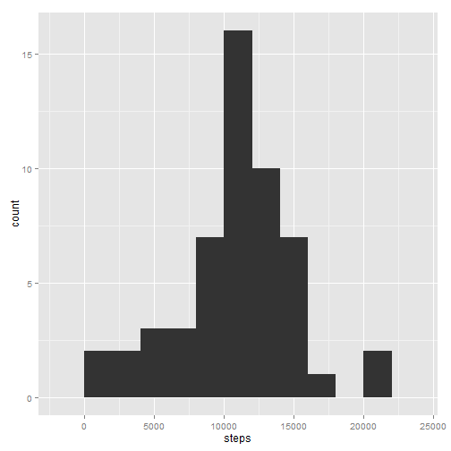
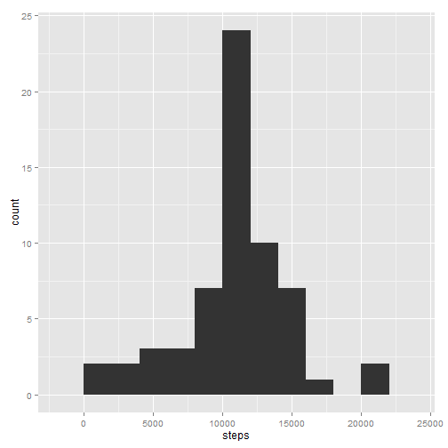
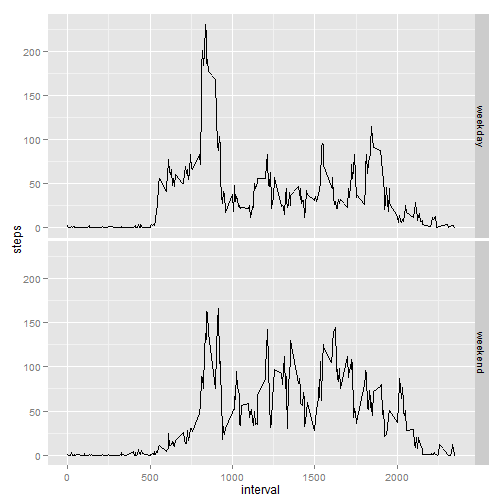

# Reproducible Research: Peer Assessment 1  


## Loading and preprocessing the data
Load the data

```r
data <- read.csv(unz("activity.zip","activity.csv"))
```
Transform date column into date format and remove all *NA* records

```r
data$date <- as.Date(data$date)
activity <- subset(data, !is.na(data$steps))
```
## What is mean total number of steps taken per day?  
Calculate total number of steps taken per day by aggregating all intrevals grouped by date

```r
byday <- with(activity, aggregate(steps, list(date), FUN=sum) )
names(byday) <- c("date", "steps")
```
Make a histogram of the total number of steps taken per day  
ggplot2 library is used for graphic purposes

```r
library(ggplot2)
qplot(steps, data=byday, binwidth=2000)
```

 

Calculate the **mean** and **median** total number of steps taken per day  

```r
mean(byday$steps)
```

```
## [1] 10766
```

```r
median(byday$steps)
```

```
## [1] 10765
```

## What is the average daily activity pattern?
Calculate average number of steps taken in particular interval, averaged across all days

```r
byint <- with(activity, aggregate(steps, list(interval), FUN = mean))
names(byint) <- c("interval", "steps")
```
Make a time series plot of the 5-minute interval (x-axis) and the average number of steps taken, averaged across all days (y-axis)

```r
qplot(interval, steps, data=byint, geom = "line")
```

 

Which 5-minute interval, on average across all the days in the dataset, contains the maximum number of steps?

```r
maxpoint <- byint[byint$steps == max(byint$steps),]
maxpoint
```

```
##     interval steps
## 104      835 206.2
```
So maximum number of steps were taken in **835** interval

## Imputing missing values
Calculate and report the total number of missing values in the dataset

```r
nanum <- nrow(data[is.na(data$steps),])
```
There are **2304** missing values in original dataset

Replace missing values with rounded mean values for corresponding missing interval

```r
newactivity <- data
newactivity$steps[is.na(newactivity$steps)] <- rep(round(byint$steps),61)[is.na(newactivity$steps)]
```

Again calculate total number of steps taken per day

```r
newbyday <- with(newactivity, aggregate(steps, list(date), FUN=sum) )
names(newbyday) <- c("date", "steps")
```

And plot the histogram of the total number of steps taken per day

```r
qplot(steps, data=newbyday, binwidth=2000)
```

 

As well as mean and median of the modified data

```r
mean(newbyday$steps)
```

```
## [1] 10766
```

```r
median(newbyday$steps)
```

```
## [1] 10762
```

**Results of imputing**:  
The mean and median values after imputing missing data on their average values is slightly different than before because of *round* operation.
Though such replacement has impact on total number of steps per day, at least for those that was missing.

The maximal difference occure on missed days and is **10762** steps, which is exactly the average number of steps per day.

## Are there differences in activity patterns between weekdays and weekends?
Create a new factor variable in the dataset with two levels – “weekday” and “weekend” indicating whether a given date is a weekday or weekend day.


```r
f<-weekdays(newactivity$date) %in% c("Saturday", "Sunday")
newactivity$weekday<-"weekday"
newactivity[f,"weekday"] <- "weekend"
newactivity$weekday <- factor(newactivity$weekday)
```

Make a panel plot containing a time series plot (i.e. type = "l") of the 5-minute interval (x-axis) and the average number of steps taken, averaged across all weekday days or weekend days (y-axis).

```r
newbyint <- with(newactivity, aggregate(steps, list(interval,weekday), FUN = mean))
names(newbyint) <- c("interval", "weekday", "steps")
qplot(interval, steps, data=newbyint, facets=weekday ~ ., geom="line")
```

 

